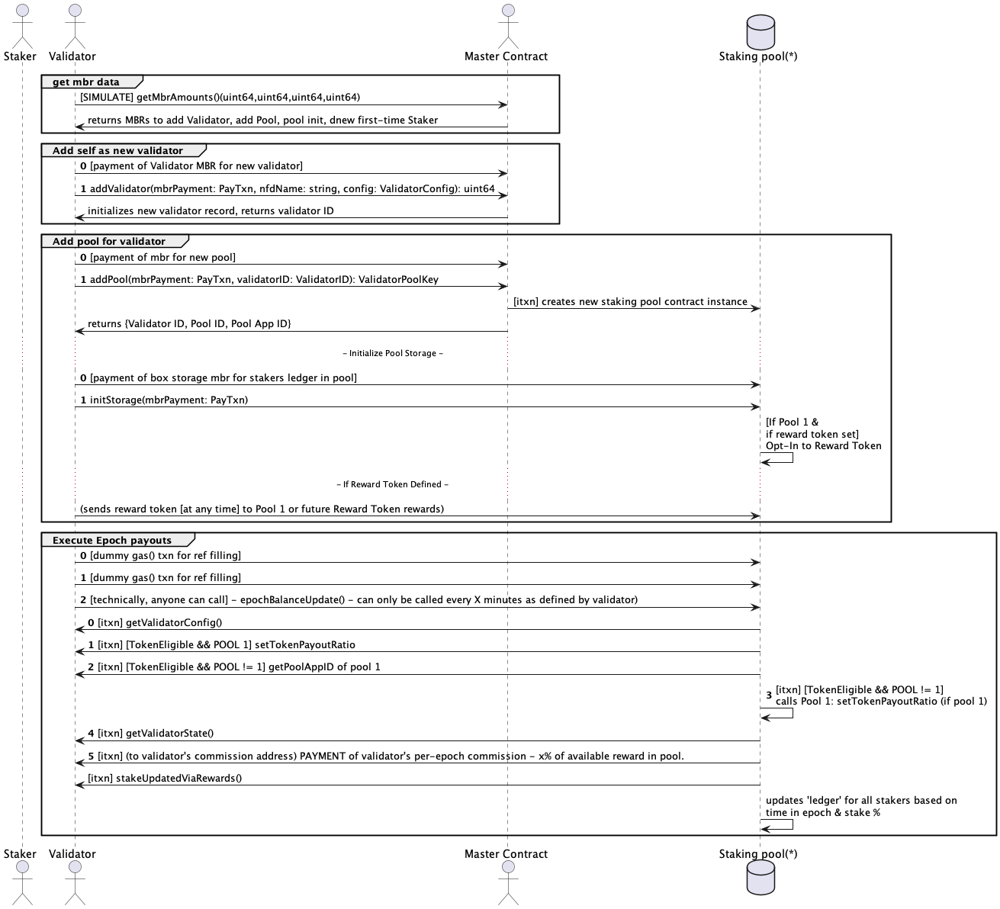
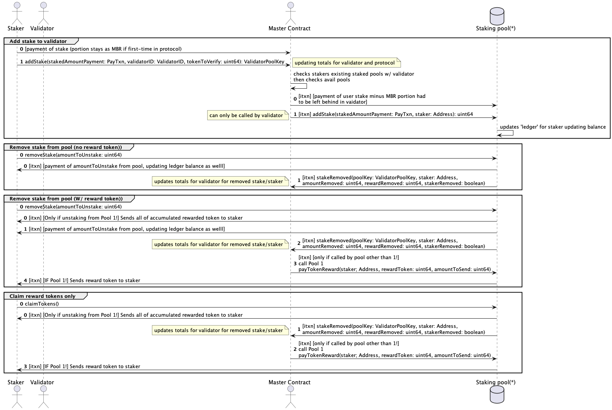

TxnLab, Inc.

# Reti Open Pooling
## Proposal for Réti Open Validator Staking pools

### I. Objectives

*   **Increase Participation in Algorand Consensus:** Provide an option for permissionless staking pools. Users and validators can earn yield and protect the network by trustlessly Pooling their stake together and participating in consensus.
*   **Enhance Overall Security with a Variety of Approaches:** It's likely that Folks Finance and other companies will offer Liquid Staking products that centralize stake, as seen in other ecosystems(LIDO on Ethereum). Open and permissionless staking pools offer a different approach, where anyone can run a validator / create a pool, and where anyone can participate in those pools. This should make it possible to diversify the stake onto far more nodes than if only proprietary solutions are offered.

### II. Rationale for an Open-Source Implementation

*   **Incentivizing Many Validators:** The proposed node incentives are going to drive users to stake their ALGO rather than lock-up in governance or defi . Ideally, there is an economic model that allows everyone to benefit from this, including small projects who want to offer staking services. These smaller developers / communities can use these contracts to launch their own staking pools and pool with their already established communities. We see this being popular with the memecoin and NFT communities on Algorand as it offers their projects a reliable revenue stream.
*   **Viable Alternatives:** Proposing an open-source implementation for staking pools ensures there's at least one viable alternative to the more stake-centralized approaches.

### III. Proposed Solution

****

*   **Overview:**  A comprehensive open-source codebase covering smart-contracts, back-end infrastructure, basic system tests, and front-end interfaces for staking pools. Validators will be able to create staking pools with different configurations, allowing a certain amount of stake into their pools. Stakers will be able to participate in these pools through various front-end interfaces(most likely offered by community projects ), but a basic UI will be provided that users can launch on their own machines that provide staking controls. This same UI could be hosted by the Foundation to start. 
*   **Customization:** All parameters can be adjusted by the validator when configuring their pools, offering maximum flexibility for any community. Things like minimum stake amount, commission, and max stak e amount can be set by each validator. Certain parameters can't be changed so that validators can't change the rules on stakers . Being open-source, new variations of the contract could certainly be created and deployed by users but they would be completely different validators and pools at that point as they would be under a different 'validator' registry contract.
*   **Smart-Contract Code:** The contracts will be written with AlgoKit / TEALScript. Early work on these contracts have already led to significant improvements in TEALScript and AlgoKit tooling as the boundaries are pushed and bugs are found. The resulting contracts should provide a good example of a fully functioning, broadly used dApp with multiple language SDK use (Go, and TypeScript).
*   **Back-end and Front-end Code:** The Réti node daemon will be written in Go and is planned to run on the primary supported platforms (Linux, OSX) as a native binary. The simple front-end will likely be TypeScript/React. The front-end example will be functional but basic as we will not be offering our own staking service. Basic add, view, stake/unstake functionality will be there but it will lack analytics/reporting.

### IV.  Technical Specifications Overview

**Arbitrary Validators**

**General Process:** [Validators can be added by anyone, adhering to
predefined configuration settings to ensure stability and fairness.
These settings include fixed fees, payout schedules, and reasonable node
operation guidelines.]{.c0}

----

**Key Elements Defined by Validators:**

*   **Owner Address:** Ideally, a cold-wallet address for security.
*   **Management Address:** A hot-wallet address accessible by the 'reti node daemon' for operational commands.
*   **Payout Epoch Time:** Frequency of payout balance adjustments (daily, weekly, etc.).
*   **Validator Fee Percentage:** Share of earned rewards for  covering operating costs.
*   **Fee Payment Address:** An Algorand address designated for  receiving validator fees, changeable by the owner.
*   **Minimum Stake:** Establishes a lower limit for participation  to avoid minimal contributions.
*   **Maximum Stake Per Pool:** Capped to encourage equitable incentive distribution.
*   **Pools Per Node:** Recommends a maximum of 3 pools per node, with a possibility of extending up to 6.
*   **Maximum Nodes:** Soft limit on node count to manage the overall number of pools effectively.
*   **NFD ID (Optional):** For associating validators with detailed information for transparency.
*   **Token / NFD Gating:** Validators can require stakers hold certain types of assets in order to join their pools. This can be used to restrict validator pools to members of a particular community - NFT holders, special 'membership' tokens, etc. Supported options are:
    *   **Tokens/NFTs** by Creator and min amount (Optional): Can set a creator account such that all stakers must hold an ASA created by this account (w/ optional minimum amount for tokens).
    *   **Specific ASA ID**.
    *   **Tokens/NFTs created by any address linked within a particular NFD**. This is so NFT projects with multiple creation wallets can just reference their NFD and then anyone holding an asset created by any account linked w/in the NFD is eligible.
    *  **Owning a segment (including via linked addresses) of a particular NFD Root.** A project could have its own project root NFD, e.g., orange.algo, barb.algo, voi.algo, etc., and specify that only people owning a segment of a specific root can join.
    *   **Reward token and reward rate (Optional)** : A validator can define a token that users are awarded in addition to the ALGO they receive for being in the pool. This will allow projects to allow rewarding members their own token, e.g., hold at least 5000 VEST/COOP/AKTA, etc., to enter a staking pool, with 1 day epochs, and all stakers get X amount of their token as daily rewards (added to stakers' available balance) for removal at any time.
*   **Sunsetting information** : Validators will be able to sunset their validators, leaving guidance for stakers that they're going away or moving to a new validator configuration.

----

Staking Pools

*   **Pool Creation:** Validators can initiate new pools within their node limit, each acting as a distinct Algorand account for consensus participation.
*   **Stake Addition:** Users can contribute to specific validators, with allocations managed through a central validator contract to appropriate pools.
*   **Ledger System:** Tracks up to 200 stakers per pool  , documenting each participant\'s stake amount and total rewards to ensure fair reward distribution. This system allows direct on-chain instant views of all individual staker information, and their compounded balances. To prevent dusting and too small of pools, minimum amounts per staker are encouraged. Setting 1,000 ALGO minimum per staker for example would ensure no pool was less than 200K ALGO and prevent easy competitor 'dust' attacks on the pools.\The ledger model also helps encourage a broader distribution. 
*   **Payout Mechanism:** Calculates rewards based on current balances, sending validator commission and adjusting compounded balances for all stakers after accounting for validator fees and adjusting for stake duration within the payout epoch.

----

**Reti Node Daemon**

*   **Functionality:** Acts as both a command-line interface and a service daemon, compatible across Linux and OSX platforms. Windows could be supported in the future but is still problematic.
*   **Management:** Facilitates validator and pool configuration, leveraging a \'manager\' account for transaction signatures.
*   **Participation Key Management:** Automates the creation and renewal of participation keys to maintain pool activity and online status.

----

Monitoring

*   **Ecosystem Role:**  Validator performance monitoring is externalized, relying on community-driven data to assess reliability, fees, and proposal/vote accuracy.  Some minimal metrics will likely be exposed via Promethus compatible endpoints by the daemon should the validator wish to make use of them.
*   **Decision Basis:** Users select validators based on performance metrics, trust, and cost-effectiveness, utilizing available data for informed staking decisions.

----

### V. High-Level Diagrams

----
#### Basic Validator Operations

----
#### Basic Staker Operations

### VI. Conclusion

*   **Empowering developers:**  By providing comprehensive open-source staking pool contracts, individual users, projects and communities will be incentivized and empowered to run nodes and create pools for their communities, decentralizing the stake and creating a healthier network.
*   **Empowering small holders: ** This solution allows users with potentially very small ALGO balances to participate in staking directly to a node, instead of being locked out of participating entirely due to minimum balances, or being forced into staking solutions tied only to a single provider. 
*   **Improving overall network health:** What we want to avoid is centralizing the stake onto a few nodes or to a few node providers. This approach will create competition between validators to offer many different pools on different nodes, to accommodate different sized stakers as well as different communities. This hopefully leads to a better distribution of stake, increasing the reliability of the network.

